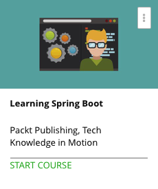

```
Roberto Nogueira  
BSd EE, MSd CE
Solution Integrator Experienced - Certified by Ericsson
```
# Udemy Learning Springboot



**About **

Learn everything you need to about the subject of this `Udemy` project.

[Homepage](https://www.udemy.com/learning-spring-boot)

## Topics
```
Section: 1
0 / 4
Building a Spring Boot App from Scratch with Spring Initializr
[x] 1. The Course Overview 3:03
[x] 2. Website Navigation 5:43
[x] 3. Picking Options for Our App 6:34
[x] 4. Unpacking and Importing the Bundled App into Our IDE 9:11

Section: 2
0 / 2
Defining the Domain
[x] 5. Creating a JPA Entity to Represent an Image 3:23
[x] 6. Creating a Repository Interface for the Image Domain Object 5:58

Section: 3
0 / 3
Creating a File Upload Controller
[ ] 7. Creating a Service to Store Images 9:08
[ ] 8. Creating a Spring MVC Controller to Handle Incoming Requests 10:14
[ ] 9. Handling Images with cURL 6:15

Section: 4
0 / 2
Building a Frontend with Templates
[ ] 10. Building a Web Template to Fetch Images 9:28
[ ] 11. Including Basic CSS to Show Thumbnails 4:39

Section: 5
0 / 3
Adding Image Controls to the Frontend
[ ] 12. Adding a Form to Upload an Image 7:36
[ ] 13. Adding a Delete Button for Each Image 6:12
[ ] 14. Adding Page Navigation and Tuning File Upload Limits 8:14

Section: 6
0 / 5
Adding Spring Boot Actuator
[ ] 15. Touring the Management Endpoints 9:58
[ ] 16. Exploring the Auto-configuration Report 13:33
[ ] 17. Creating a Custom Metric 5:55
[ ] 18. Creating a Custom Health Stat 5:32
[ ] 19. Creating Custom App Information 6:20

Section: 7
0 / 4
Adding Spring Boot DevTools
[ ] 20. Exploring Hot Swapping of Code and De-caching Templates 6:01
[ ] 21. Developing Remotely in a Target Environment with Your Local IDE 5:21
[ ] 22. Debugging a Remote App with DevTools 6:47
[ ] 23. Turning Your App into an Executable Unix/Linux Service 6:16

Section: 8
0 / 2
Adding CRaSH Remote Shell
[ ] 24. Touring the Remote Shell 6:06
[ ] 25. Creating Custom Commands 12:26

Section: 9
0 / 2
Adding WebSocket-Based Messaging
[ ] 26. Configuring WebSocket Support on the Server Side 5:53
[ ] 27. Defining Events for Image Creation and Deletion 6:07

Section: 10
0 / 2
Adding WebSocket Messaging to the UI
[ ] 28. Adding WebSocket and SockJS Modules to the Frontend 8:01
[ ] 29. Registering WebSocket Message Handlers 8:19

Section: 11
0 / 2
Defining Our Security Policy
[ ] 30. Securing Our Site with a Simple Policy 7:40
[ ] 31. Creating an In-memory Set of Users with Roles 5:38

Section: 12
0 / 2
Decorating Images with User Data
[ ] 32. Adding User Data to the Domain Model 9:10
[ ] 33. Linking User Session with Image before Storing 8:12

Section: 13
0 / 2
Securing Operations with Authorization Rules
[ ] 34. Adding URL-based Security Controls 8:37
[ ] 35. Applying Method-level Security Controls 11:33
```
